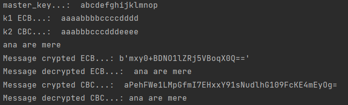
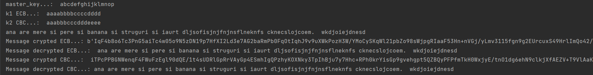

# Problema 

Implementati o infrastructura de comunicatie ce foloses, te criptosistemul AES pentru criptarea traficului
dintre doua noduri A s, i B cu urmatoarele caracteristici:

- se considera un nod MC (manager de chei) care detine trei chei pe 128 de biti: k1, k2 s, i K
  * cheia k1 este asociata cu modul de operare ECB;
  * cheia k2 este asociata cu modul de operare XXX (se considera ca vectorul de initializare are o
      valoare fixata, cunoscuta in prealabil de cele doua noduri A s, i B);
  * cheia K este utilizata pentru criptarea cheilor k1 sau k2. Cheia K este detinuta din start de
      nodurile A, B s, i MC.
- Pentru a initia o sesiune de comunicare securizata, nodul A trimite un mesaj catre nodul B ın care
comunica modul de operare (ECB sau XXX); de asemenea, nodul A transmite un mesaj nodului MC
prin care cere cheia corespunzatoare (k1 pentru modul de operare ECB, respectiv k2 pentru modul de
operare XXX).
- Nodul B, la primirea mesajului de la nodul A, cere nodului MC cheia corespunzatoare (k1 pentru
modul de operare ECB, respectiv k2 pentru modul de operare XXX).
- nodul MC va cripta cheia ceruta (k1 sau k2 ın funct, ie de modul de operare ales) ca un singur bloc,
utilizand criptosistemul AES cu cheia K s, i va trimite mesajul astfel obtinut ca raspuns pentru nodurile
A s, i B;
- cele doua noduri A s, i B vor decripta mesajul primit de la MC s, i vor obtine astfel cheia ceruta;
- nodul B trimite, dupa primirea cheii, un mesaj nodului A prin care ıl anunta ca poate sa ınceapa
comunicarea;
- nodul A cripteaza continutul unui fisier text utilizand AES, cheia primita de la MC si modul de operare
ales. A va transmite nodului B blocurile de criptotext obtinute pe rand, iar nodul B va decripta blocurile
primite si va afisa rezultatul obtinut.

## Observatii:

- se accepta utilizarea oricarui limbaj de programare si folosirea oricarei librarii criptografice pentru
implementare;
- AES poate fi folosit ca algoritm de criptare pus la dispozit, ie de orice librarie criptografica.
- se cere ca modurile de operare (ECB s, i XXX) sa fie implementate ın cadrul temei, unde XXX poate fi
unul din modurile {CBC, OF B, CF B}.
- nu se cere rezolvarea de eventuale probleme de sincronizare ˆıntre noduri, interfat,˘a pentru noduri, sau
un anumit protocol de comunicare.

## Detalii de implementare

Proiectul a fost realizat in PyCharm, un IDE de la JetBarins care imi permite sa compilez si sa rulez cu usurinta programe scrise in limbajul Python.
Pentru aceasta a fost necesar sa instalez package-ul *pycryptodomex* pentru a realiza criptarea AES pentru CBC si ECB cu ajutorul librariei *Cryptodome.Cipher*.
In plus, legatura dintre cele doua noduri A si B care-si transmit mesaje a fost obtinuta prin folosirea bibliotecii *threading*. Am decis sa creez cate un thread pentru fiecare si m-am folosit de functia *lock* pentru a asigura ordinea de transmitere a comenzilor. 

#### Mod de lucru

Am ales sa creez 2 thread-uri care sa faca legatura intre nodurile A si B. Am creat 3 noduri A,B SI MC si le-am instantiat cu diferite atribute pe care le-am ales. 

In thread-ul A, am 3 comenzi principale:
- [x] decriptarea cheilor k1 si k2 din MC in functie de ce criptare se alege
- [x] primirea de raspuns de la B conform careia poate sa porneasca trimiterea mesajului
- [x] criptarea mesajului pe care il trasnmite lui B

Cat despre thread-ul B:
- [x] si el decripteaza cheile k1, k2 luate de la MC
- [x] trimite mesajul *i'm ready* lui A pentru a-i da permisiune ca poate incepe comunicarea
- [x] si primeste mesajul de la A pe care il decripteaza

## Teste

Prima imagine ilustreaza modul cum o sa arate cele doi chei, k1 si k2 dupa ce sunt criptate cu *master_key*.

A doua imagine evidentiaza cum o sa arate criptate mesajele mai mici sau egale cu 16 ca dimensiune. 

 
Urmatoarea imagine prezinta rezultate care au loc la criptarea unui mesaj mai lung de 16 bytes

## Bibliografie
* https://pythontic.com/queue-module/queue-class/put
* https://data-flair.training/blogs/python-multithreading/
* https://gist.github.com/lopes/168c9d74b988391e702aac5f4aa69e41
* https://gist.github.com/h0rn3t/4216cf787b43060b5afc2d50086918bc
* https://docs.python.org/2/library/queue.html#Queue.Queue.get
* https://pythontic.com/queue-module/queue-class/empty

